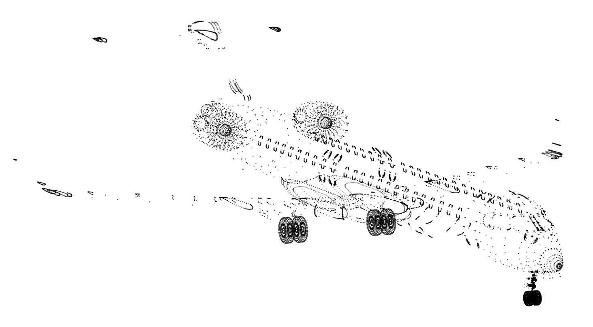

# Machine Learning on Meshes
As part of my internship with Monumo, I worked on some cool models for predicting magnetic fields in motors from 3D surface meshes. Unfortunately, my code is confidential, so I can't share it publicly. To get around this, I made this repository where you can find similar models to those I worked on in my internship, just used for classification on the ModelNet40 dataset rather than being applied to electric motors.

## Implementation of PCT: Point Cloud Transformer paper
This repo contains my implementation of the SPCT model from this paper https://arxiv.org/abs/2012.09688

